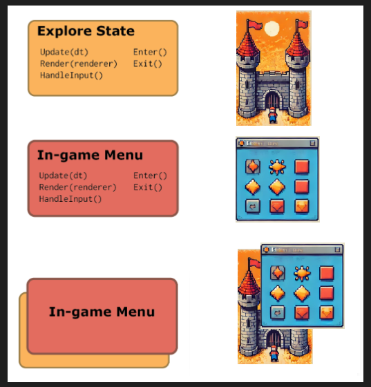

Title: Stack State
Date: 2024-08-23
Category: Devlog
Tags: game development, progress
Author: Thomas Edwards
Summary: TBA

The state stack is a powerful tool for managing transitions between different states. It’s ideal for dynamic systems like UI elements, game maps, and cut scenes.

In a Role-Playing Game, for instance, while exploring a dungeon, the game is in the 'explore state.' This state sits at the top of the stack, drawing itself, handling inputs and updates. When you open the in-game menu, the 'menu state' is pushed onto the stack, taking control and pausing the exploration. During this time, all inputs go to the menu, while the explore state remains inactive.

Once you close the menu, the 'menu state' is popped off, and the game seamlessly returns to the 'explore state,' letting you continue your adventure.



While this is a basic example, it's easy to see how this system can be extended to handle more complex scenarios.

Let’s now dive into implementing the state stack. We'll use C++17 to create a structure that balances simplicity and versatility.

# State Interface 

A state must be able to update, render itself, and handle input.

```cpp
class IState
{
public:
    virtual ~IState() { };
    virtual bool Update() { return true; };
    virtual void HandleInput() { };
    virtual void Draw() { };
};
```

Note the virtual destructor: it ensures that when a derived object is deleted via a base class pointer, the correct destructor is called, enabling proper resource cleanup.

# Stack State Data Strucutre
This class is a bit more complex. I'll walk through the structure, implementing each method and explaining the thought process along the way. You'll notice that unique pointers are used for state management, ensuring proper memory handling, preventing leaks, and automatically cleaning up states when they are no longer needed.

This is the starting point for our class, featuring two key member variables: mStates, which holds the stack of states with the top-most (current) state at the end, and mPendingRemoval, a queue that manages states scheduled for safe removal from the stack.

```cpp
class StateStack
{
public:
    ...

private:
    std::vector<std::unique_ptr<IState>> mStates;
    std::vector<std::unique_ptr<IState>> mPendingRemoval;
};
```

## Checking the Top State
The simplest behavior to implement is checking if a state is on top of the stack. If the stack is empty, the method returns nullptr, making it easy to verify whether a state exists.

```cpp
class StateStack
{
public:
    IState* Top()
    {
        if (!mStates.empty())
        {
            return mStates.back().get();
        }
        return nullptr;
    }
    ...    

private:
    std::vector<std::unique_ptr<IState>> mStates;
    std::vector<std::unique_ptr<IState>> mPendingRemoval;
};
```

## Pushing a State onto the Stack
Next, we push a state onto the stack, transferring its ownership to the StateStack.

```cpp
class StateStack
{
public:
    void PushState(std::unique_ptr<IState> state)
    {
        mStates.push_back(std::move(state));        
    }
    ...

private:
    std::vector<std::unique_ptr<IState>> mStates;
    std::vector<std::unique_ptr<IState>> mPendingRemoval;
};
```

## Removing a State from the Stack
Removing a state from the top of the stack is a bit more complex because we need to handle scenarios where a state might remove itself during an update. For example, a TextboxState might pop itself from the stack when its dialogue is complete.

```cpp
class TextboxState : public IState
{
public:
    TextboxState(StateStack& stackState)
        : mStateStack(stackState)
    { }

    virtual bool Update() override
    {
        if (IsDialogueComplete())
        {
            mStateStack.PopState();
        }
        return true;
    }
    ...

private:
    StateStack& mStateStack;
};
```

To ensure that a state is not destroyed before it has finished its update method, we add it to a pending removal queue, which is processed after all states have been updated.


```cpp
class StateStack
{
public:
    IState* PopState()
    {
        if (!mStates.empty())
        {
            mPendingRemoval.push_back(std::move(mStates.back()));
            mStates.pop_back();

            auto state = mPendingRemoval.back().get();            
            return state;
        }
        return nullptr;
    }
    ...

private:
    std::vector<std::unique_ptr<IState>> mStates;
    std::vector<std::unique_ptr<IState>> mPendingRemoval;
};
```

## Update State

```

```

# Testing State Stack